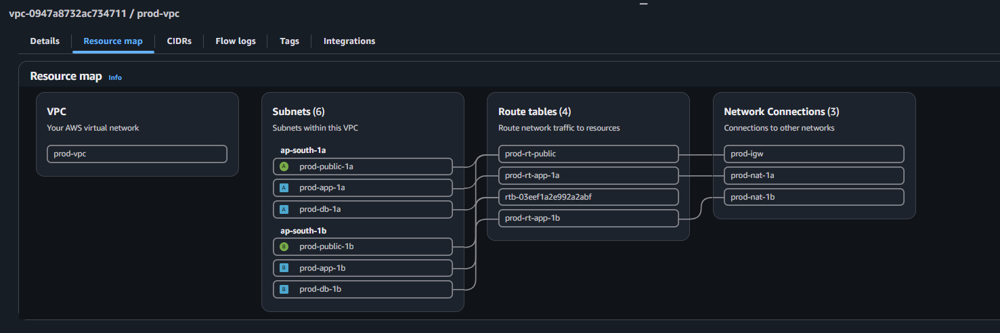

# Phase 1: VPC & Network Topology

## 1. Overview
This phase establishes the foundational network architecture for a highly available, secure 3-tier application in the `ap-south-1` (Mumbai) region. The goal is to enforce strict network isolation at the topological level, ensuring that internal resources cannot be directly accessed from the internet.

### VPC Resource Map
*(Adding this visual proof of the routing configuration)*

---

## 2. IP Addressing & Subnet Strategy
The network is built within a single VPC (`10.0.0.0/16`) and segmented into 6 individual subnets (`/24` each) spread across two Availability Zones (`ap-south-1a` and `ap-south-1b`). 

| Tier | Subnets | CIDR Block | Purpose |
| :--- | :--- | :--- | :--- |
| **Public (Lobby)** | `prod-public-1a`, `prod-public-1b` | `10.0.1.0/24`, `10.0.2.0/24` | Houses the Internet Gateway (IGW), Application Load Balancers (ALB), and NAT Gateways. |
| **App (Workspace)** | `prod-app-1a`, `prod-app-1b` | `10.0.11.0/24`, `10.0.12.0/24` | Houses the Node.js compute resources. Private by default. |
| **DB (Vault)** | `prod-db-1a`, `prod-db-1b` | `10.0.21.0/24`, `10.0.22.0/24` | Houses the RDS PostgreSQL and ElastiCache Redis clusters. Strictly isolated. |

---

## 3. Architecture Decision Records (ADRs)

### ADR 1: Subnet Naming and CIDR Convention
* **Context:** In an emergency, network engineers need to identify resources rapidly without looking up documentation.
* **Decision:** Implemented a semantic numbering scheme where the *tens* digit dictates the tier (0=public, 1=app, 2=db) and the *units* digit dictates the Availability Zone (1=AZ-a, 2=AZ-b). Subnets are explicitly sized at `/24` to provide 251 usable IPs per tier, balancing generous capacity with clear network boundaries.

### ADR 2: Multi-AZ NAT Gateway Redundancy
* **Context:** The private application servers require outbound internet access to download software updates and connect to external APIs, but they should not be addressable from the internet.
* **Decision:** Deployed two separate NAT Gateways (one in each public subnet) and attached them to two distinct private route tables (`prod-rt-app-1a` and `prod-rt-app-1b`). 
* **Justification:** If `ap-south-1a` experiences a catastrophic physical failure, the app instances in `ap-south-1b` will maintain outbound connectivity through their own dedicated NAT Gateway. Using a single shared NAT Gateway would create an unacceptable single point of failure.

### ADR 3: Topological Database Isolation
* **Context:** The most common vector for database breaches is accidental exposure to the public internet via misconfigured Security Groups.
* **Decision:** The DB subnets (`prod-db-1a` and `prod-db-1b`) deliberately have no route table assigned to them other than the main local VPC route. 
* **Justification:** By ensuring there is no route to an Internet Gateway or a NAT Gateway, it becomes topologically impossible for internet traffic to reach the database tier. Security is enforced at the hardware/routing layer, acting as a foolproof safety net beneath software-defined Security Groups.