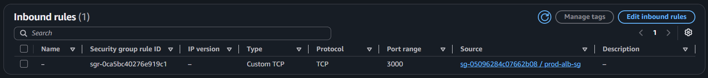
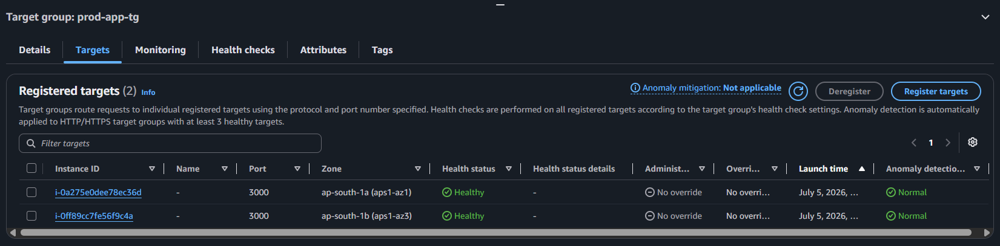

# Phase 2: Compute, Load Balancing & Auto Scaling

## 1. Overview
This phase provisions the compute layer of the application. It utilizes an Application Load Balancer (ALB) in the public subnets to ingest internet traffic and route it to an Auto Scaling Group (ASG) of Node.js servers residing entirely within the private subnets. 

### Evidence of Execution
*Security Group Chaining (App tier only accepts traffic from ALB):*

*Target Group Health (Instances successfully provisioned and serving traffic):*

---

## 2. Architecture Decision Records (ADRs)

### ADR 1: Security Group "Chaining" vs. IP Whitelisting
* **Context:** The application servers (port 3000) need to accept traffic from the load balancer.
* **Decision:** Instead of whitelisting the VPC CIDR block, the Inbound rule on the `prod-app-sg` strictly references the Security Group ID of the ALB (`prod-alb-sg`). 
* **Justification:** This enforces a hard topological rule: even if a rogue instance is launched in the same VPC, it cannot communicate with the app servers unless it passes through the load balancer. Furthermore, SSH (port 22) is completely disabled across all security groups; instance access is handled exclusively via AWS Systems Manager (SSM) Session Manager to eliminate exposed attack surfaces.

### ADR 2: User Data Bootstrapping and Process Management
* **Context:** Instances launched by the ASG must automatically configure themselves without human intervention.
* **Decision:** The EC2 Launch Template injects a bash script via User Data that installs Node.js, downloads the application code, and starts the server using **PM2** (a production process manager). 
* **Justification:** Relying on raw `node app.js` is fragile; if the Node process crashes, the OS remains healthy, and the load balancer continues routing traffic to a dead application. PM2 ensures the process automatically restarts on failure, bridging the gap between application-level crashes and OS-level health.

### ADR 3: Aggressive Health Checks and ASG Integration
* **Context:** The load balancer needs to route traffic only to healthy instances, and the ASG needs to replace dead ones.
* **Decision:** The Target Group health check was tightened from the AWS defaults (interval reduced to 10s, threshold to 2 failures). Crucially, the ASG Health Check Type was switched from the default `EC2` to `ELB`.
* **Justification:** By default, an ASG only replaces an instance if the underlying hypervisor or OS fails (EC2 check). By switching to `ELB` checks, the ASG delegates health verification to the load balancer. If the application itself locks up and stops returning `HTTP 200` to the `/health` endpoint, the ASG will terminate the instance and launch a fresh replacement.

### ADR 4: 120-Second Health Check Grace Period
* **Context:** Bootstrapping a new instance takes time (OS updates, downloading packages, starting PM2).
* **Decision:** Configured a 120-second Health Check Grace Period on the Auto Scaling Group.
* **Justification:** Without this grace period, the ASG would evaluate the instance's health immediately upon boot. Because the app hasn't finished installing yet, the ALB would report it as unhealthy, prompting the ASG to terminate it. This creates an infinite loop of terminations. 120 seconds provides sufficient time for the user data script to complete before health evaluation begins.